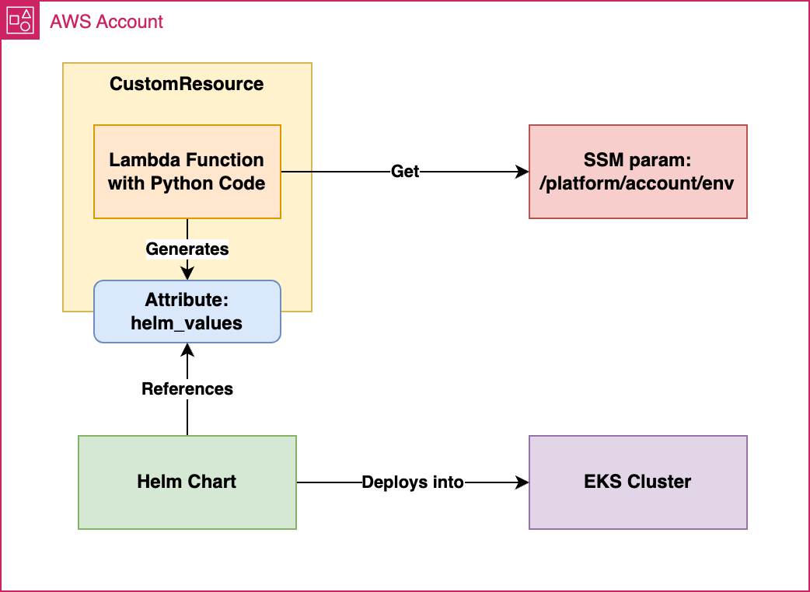

# MyAssessmentProject

This project demonstrates the deployment of an AWS CDK stack for creation of EKS Cluster, Lambda, SSM Parameter and the installation of the Ingress-Nginx Helm chart on an Amazon EKS cluster.


## Prerequisites

Before you begin, ensure you have the following installed and configured:

- **AWS CLI**: Installed and configured with appropriate credentials.
- **Python 3.x** and **pip**: Installed on your system.
- **AWS CDK**: Install globally using `npm install -g aws-cdk`.
- **eksctl tool**: Installed using package manager e.g. brew install eksctl
- **Helm**: Installed (or the script will install it for you).
- **AWS Account**: An active AWS account is a requirement for this task.
- **An existing Amazon User IAM Credentials or aws config completed beforehand**.

## Installation

1. **Clone the repository:**

    ```bash
    git clone https://github.com/nileshchoudhary62/MyAssessmentProject
    cd MyAssessmentProject
    ```

2. **Create and activate a virtual environment:**

    On macOS and Linux:

    ```bash
    python3 -m venv .venv
    source .venv/bin/activate
    ```

    On Windows:

    ```bash
    python -m venv .venv
    .venv\Scripts\activate.bat
    ```

3. **Install Python dependencies:**

    ```bash
    pip install -r requirements.txt
    pip install -r requirements-dev.txt
    ```

## Usage

1. **Run the deployment script:**

    ```bash
    ./deploycdkproject.sh
    ```

    This script performs the following tasks:
    - Installs Python dependencies.
    - Runs unit tests.
    - Deploys the CDK stack.
    - Retrieves the Lambda function ARN and EKS cluster name.
    - Updates the local Kubeconfig with the EKS cluster details.
    - Invokes the Lambda function to retrieve Helm values.
    - Generates a Helm values file based on the Lambda output.
    - Installs or upgrades the Ingress-Nginx Helm chart with the generated values.
    - Monitors the script output for any errors or exit status.

## Useful CDK Commands apart from the one I used in the script

- `cdk ls`          List all stacks in the app.
- `cdk synth`       Emit the synthesized CloudFormation template.
- `cdk deploy`      Deploy this stack to your default AWS account/region.
- `cdk diff`        Compare the deployed stack with the current state.
- `cdk docs`        Open CDK documentation.
